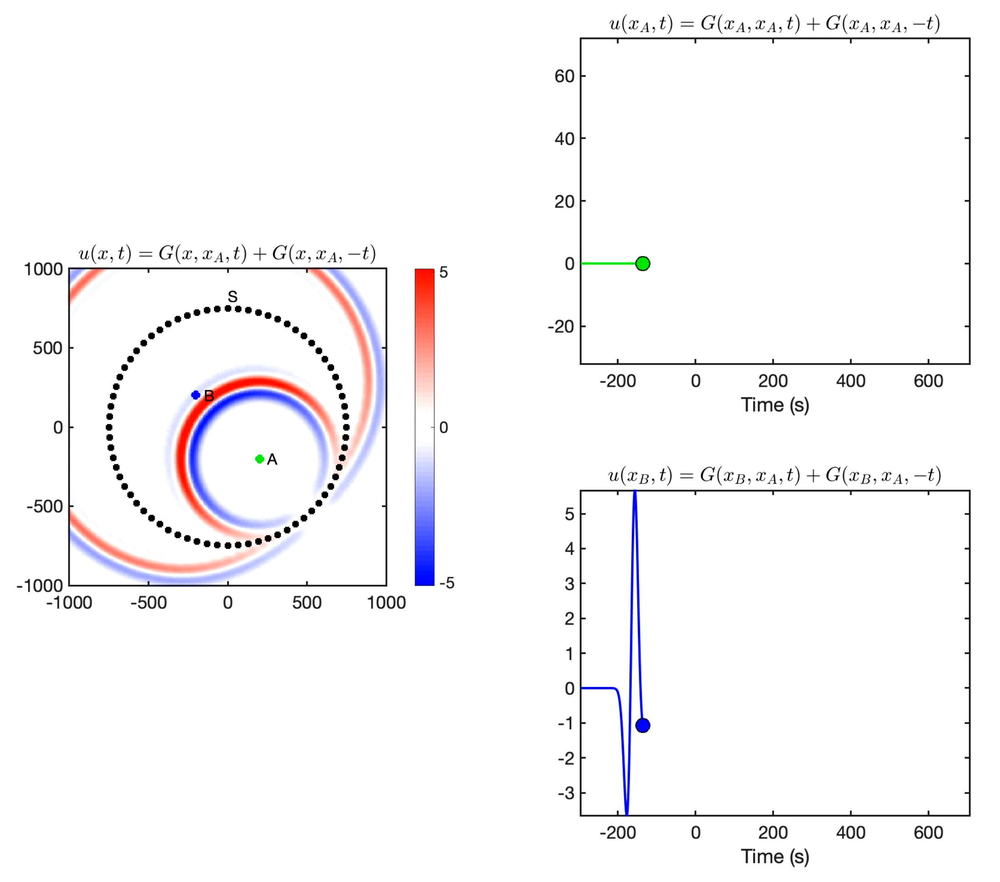

# mat-noise_sim
Sandbox for simulating seismic noise within a homogeneous, isotropic, acoustic half-space in MATLAB

# A. Visualizing Time Reversal

# B. Simulating Noise Correlation Seismograms

# C. f-k Beamforming

